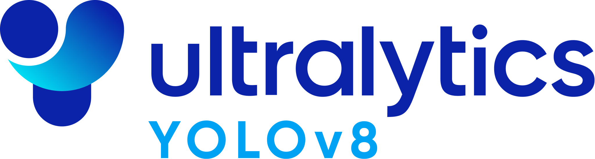

 I care deeply about researching and building with **Machine Learning/AI**, **Python**, and deploying models into **production**.

### 🏗 Best Projects
- [ROAMER (Robot for Optimized and Autonomous Mission-Enhancement Response)](https://www.dost.gov.ph/knowledge-resources/news/78-2023-news/3405-dost-asti-removing-doubts-about-ai.html#:~:text=Robot%20for%20Optimized%20and%20Autonomous%20Mission%2DEnhancement%20Responses%20(ROAMER)) - An initiative by Department of Science and Technology in the Philippines that develops autonomous mobile robots to monitor and manage agricultural environments, particularly for early detection of diseases in banana plantations using AI and Robotics.
- [Video Lens](https://github.com/starkproj/) - A web app for video content analysis using Computer Vision and Natural Language Processing.
- [Image Colorizer: Back to Life](https://github.com/ralphcajipe/image-colorizer#readme) - A desktop app that uses deep learning to colorize black and white images.
- [E.C.H.O. (Enhanced Chats and Helpful Outputs)](https://github.com/ralphcajipe/echo-ai) - An AI chatbot powered by GPT-3.5, designed to assist with helpful, creative, clever, and very friendly responses.
- [International Space Station Tracker](https://github.com/ralphcajipe/International-Space-Station-Tracker) - A tracker for the International Space Station using Open Notify API.

### 🧠 AI

### 🚀 Machine Learning Operations (MLOps)

### 🌐 Web Development

### ⭐ RELEVANT CERTIFICATIONS, CERTIFICATES, AND BADGES

* [Machine Learning Specialization](https://www.coursera.org/account/accomplishments/specialization/certificate/VF2GQZZUV7A5) - Stanford University and DeepLearning.AI
* [Machine Learning Engineering for Production (MLOps) Specializationn](https://www.coursera.org/account/accomplishments/specialization/certificate/V5UJU7RBKETB) - DeepLearning.AI
* [Certified IT Specialist in Python](https://www.credly.com/badges/3c723206-75b7-4689-80d0-454bc03ad6ab)
* [Machine Learning with Python Developer Certification](https://www.freecodecamp.org/certification/ralphcajipe/machine-learning-with-python-v7) - freeCodeCamp
* [CS50's Introduction to Computer Science](https://certificates.cs50.io/adc2f033-16f9-4d58-bd33-f48431c2a92e.pdf?size=letter) - Harvard University
* [CS50 Python](https://certificates.cs50.io/a2df9b8d-b01a-46f4-bca2-25d9082c8c33.pdf?size=letter) - Harvard University
* [AI For Everyone](https://www.coursera.org/account/accomplishments/certificate/KAVAW28N32DQ) - DeepLearning.AI
* [Artificial Intelligence Foundations: Machine Learning](https://drive.google.com/file/d/1zRBmMjQUZtSX5DwyFtoOdKy3jgO233nn/view) - LinkedIn Learning
* [Become a Machine Learning Specialist](https://drive.google.com/file/d/1O7Xs4v7fXaz0qpkW89MvNPJIcGSouB6o/view) - LinkedIn Learning
* [AWS Cloud Quest: Cloud Practitioner](https://www.credly.com/earner/earned/badge/9005c877-bcd1-4d80-8b59-d1be77027be0)

 I have obtained other certifications from 2018 to the present, including those for Python, Data Analytics, Java, IoT, and DevNet.

### 📚My education

My foundation for writing clean software roots in books and courses from leaders of specific topics. While formal education is important, I've found that it's often not enough to achieve my goals. That's why I spend a lot of time outside of school working on practical, real-world projects that help me put my abilities to use.

**- BACHELOR OF SCIENCE (B.S.), COMPUTER SCIENCE**

_Software Engineering Specialization. FEU Institute of Technology, Philippines. 2019 - Present_

**- BACHELOR OF SCIENCE (B.S.), COMPUTER SCIENCE**

_Wesleyan University-Philippines, Philippines. 2018 - 2019_

**Coursework:** Software Applications, Computer Programming, Web Development, Living in the IT Era
